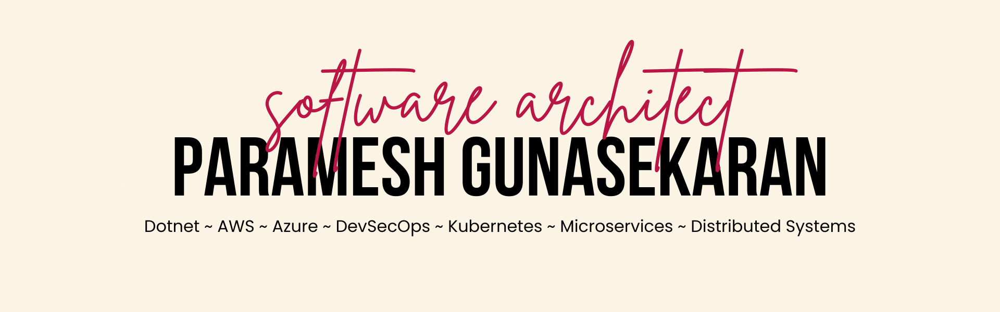

# Hey there! I'm [Param](https://www.paramg.com) 👋

    
    
    
    
    

# Technology Leader | Enterprise Architecture | Scalable Systems

I'm an software and solutions <b>architect</b>, mentor, and a full-stack developer with <b>20+ years</b> of professional experience in software development, architecture and system design. I work for [r2p Group](https://www.r2p.com) as the <b>Head of Technology</b>.

I build and lead technology that compounds. I build systems that scale. I’m interested in solving structural problems, not just shipping features. I care less about trends and more about building systems that survive growth, regulation, and operational pressure.

My work spans enterprise architecture, distributed systems, cloud infrastructure, and applied AI, with a focus on turning complex technical capability into operational advantage.

My focus is long-term architectural integrity, scalable platform strategy, and translating complex engineering capability into durable business advantage.

### What I do

#### 🧭 Technology Strategy

  I define technical vision aligned to business objectives, balance innovation with governance and risk, establish scalable architecture principles, drive platform-first thinking across teams.

#### 🏗 Enterprise Architecture

  Designing scalable, modular backend systems, multi-tenant SaaS architecture, secure system design within governance constraints, performance and reliability engineering.

#### ☁️ Cloud & Infrastructure

  AWS architecture and deployment strategies, containerisation, infrastructure-aware application design, resilient distributed services.

#### 🤖 Applied AI

  Retrieval-Augmented Generation (RAG) systems, enterprise LLM orchestration, semantic search platforms, knowledge-grounded automation, AI embedded into business workflows.

### Leadership Principles

  Architecture is a business decision. Technical debt is financial debt. Scalability must be intentional. Security and governance are foundational. Teams build systems; culture builds teams.

### Focus Areas

  Platform architecture over one-off solutions. Building internal capability, not vendor dependency. Intelligent automation inside enterprise constraints. High-leverage engineering organisations. Turning engineering into strategic advantage.

### Current Interests

  Platform unification strategies. Enterprise AI governance models. Scalable product ecosystems. Engineering maturity models. Long-term technical defensibility.

📫 You can reach me on firstname dot lastname at gmail dot com.